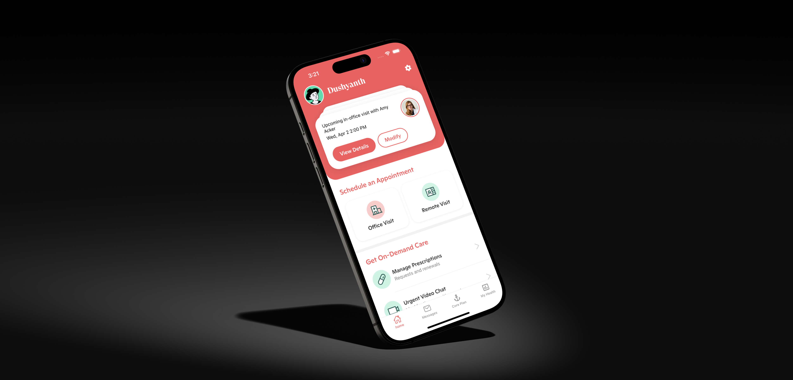

<p align="center">
  
</p>

<h1 align="center">React Native Expo App</h1>

<p align="center">
  🚀 A cross-platform mobile app built with <strong>React Native</strong> and <strong>Expo</strong>.
</p>

<p align="center">
  <a href="#features">Features</a> •
  <a href="#tech-stack">Tech Stack</a> •
  <a href="#environment-setup">Environment Setup</a> •
  <a href="#getting-started">Getting Started</a> 
</p>

---

## ✨ Features

- 🔥 Built with **Expo SDK** and custom **development build**
- 📱 Cross-platform (iOS & Android)
- 🧭 Smooth navigation with Expo router
- 🎞️ Beautiful animations with Lottie
- 💾 Global state management with Zustand + Immer
- ✅ Schema validation with Zod
- 🔁 Complex gestures & animations with Reanimated

---

## 🧰 Tech Stack

- [React Native](https://reactnative.dev/)
- [Expo](https://expo.dev/)
- [Expo Development Build](https://docs.expo.dev/development/introduction/)
- [React Navigation](https://reactnavigation.org/)
- [React Native Reanimated](https://docs.swmansion.com/react-native-reanimated/)
- [Zustand](https://zustand-demo.pmnd.rs/) + [Immer](https://immerjs.github.io/immer/)
- [Zod](https://zod.dev/)
- [Lottie](https://github.com/lottie-react-native/lottie-react-native)
- [Stream Video SDK](https://getstream.io/video/)

> ⚠️ **Note**: This app uses native modules (e.g., Reanimated, Lottie, Stream SDK) and **does not work in Expo Go**.  
> You must build and run it with a **custom development client** via `eas build` or `eas dev`.

---

## 🌱 Environment Setup

1. Create a `.env` file in the root directory of your project.
2. Use the provided `.env.example` as a reference:

```env
# .env
EXPO_PUBLIC_API_URL=https://harbor-health-server-production.up.railway.app/api
EXPO_PUBLIC_STREAM_API_KEY=38cyk2rf638c
```

---

## 🚀 Getting Started

### 🧪 Local Development & iOS Simulator Preview

This app uses native modules and requires a **local development build**, not Expo Go.

#### 🔧 Build & Run Locally

Make sure you have:

- Xcode installed (for macOS)
- iOS Simulator set up
- `pnpm` installed globally

Run the app in the iOS simulator:

```bash
pnpm install
pnpm dlx expo run:ios
```

### 📱 Running on a Physical iPhone (via Xcode)

If you'd like to run the app on your real iPhone using a local development build, follow these steps:

#### 🛠 Steps

1. Run the following to generate the native iOS project (if you haven't already):

   ```bash
   pnpm dlx expo prebuild
   ```

2. Open the iOS project in Xcode:

   ```bash
   open ios/*.xcworkspace
   ```

3. In Xcode:

- Connect your iPhone via USB
- Select your device from the top device dropdown
- Go to the Signing & Capabilities tab:
  - Select your Apple ID / Team
  - Resolve any signing or provisioning profile issues
- Press the Run ▶️ button to build and install the app on your iPhone

4. On your iPhone:

- If prompted, go to Settings > General > VPN & Device Management
- Tap Trust Developer to allow the app to launch

> ⚠️ This installs a custom development build. You still need the Metro bundler running locally:

```bash
pnpm dlx expo start
```

📦 Notes

- Use this method if you prefer manual control through Xcode or if expo run:ios --device doesn’t work
- All native modules (e.g. Reanimated, Lottie, Stream) will function correctly in this build

### 👨‍⚕️ Provider Testing

- You can use ```cjohnston@example.com``` as email at the time of login to Login as provider and test the video calling functionality. 
- When prompted for OTP just use ```18375```
- This is a workaround to test the video calling feature from the provider end. Provider App flow is WIP.
